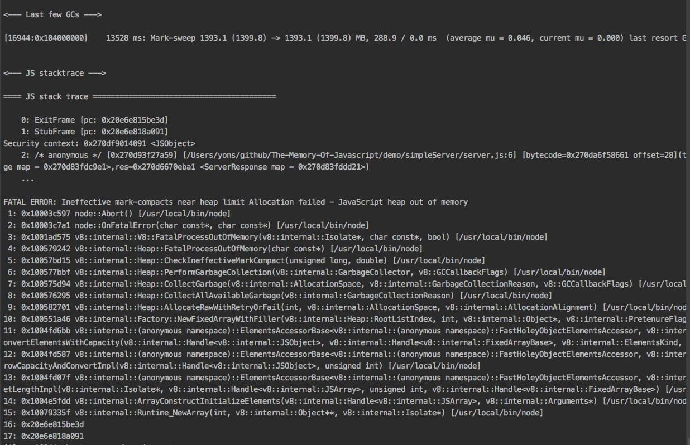
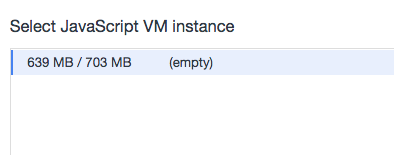

# 实例分析：一个内存泄露的demo

内存泄露这类问题的一大特点是它在开发的过程中难以发现。大部分内存泄露问题的发现都是在生产环境阶段发现的，因为内存泄露在通常情况下，并不会影响应用的功能，直到应用运行时间足够长，请求或者操作足够多的话，问题将会暴露，同时也会带来一些损失。而且让开发者更头疼的是，即使发现的应用存在内存泄露，由于缺乏充足的理论知识和调试方法，导致泄露的原因也很难定位。

本demo选取的是一个简单的node.js程序，来模拟一次服务器内存泄露导致应用崩溃的事件，并介绍在发现问题之后的一些基本的调试思路和实战方法。如果你对内存泄露的定位一点都不了解的话，本章内容将会给你建立一个基本的调试概念，以便利于后面对问题的详细分析。

## 一个内存泄露的HTTP服务器

> 本demo的代码都可以在github上进行获取：[获取地址](https://github.com/andycall/master-of-javascript-memory/blob/master/demo/simpleServer/server.js)

小A在某互联网公司工作，负责一些线上运营活动的后端开发。这个运营活动的服务是一个简易的HTTP服务器，它在每次请求都会『读取』数据库来返回一段数据。

```javascript
const http = require('http');
const uuid = require('uuid');

function readDataFromDataBase() {
    return new Array(10000).fill('xxxx');
}

const server = http.createServer((req, res) => {
    let key = uuid();
    let data = readDataFromDataBase(key);
    res.end(JSON.stringify({
        data: data
    }));
});

server.listen(3000);
console.log('Server listening to port 3000. Press Ctrl+C to stop it.');
```

小A写完代码之后，在生产环境服务器上，使用下面的命令就把服务启动起来了。

```bash
node server.js
```

由于数据库的性能并不是特别好，所以整体服务的QPS并不是很高。直到有一天，老板找到小A，下周公司要做一个运营活动，用户量应该会增长不少，于是让他优化这个服务器，让它能够支撑更多的流量。小A于是通过一个简单的对象，给`readDataFromDataBase`函数添加了缓存功能。

```javascript
const http = require('http');
const uuid = require('uuid');

function readDataFromDataBase() {
    let cache = {};
    return function(key) {
        if (cache[key]) {
            return cache[key];
        }

        let data = new Array(10000).fill('xxxx');
        cache[key] = data;
        return data;
    };
}

const server = http.createServer((req, res) => {
    let key = uuid();
    let data = readDataFromDataBase()(key);
    res.end(JSON.stringify({
        data: data
    }));
});

server.listen(3000);
console.log('Server listening to port 3000. Press Ctrl+C to stop it.');
```

通过这样的改造，缓存生效了，老板也很开心，于是小A就把这段代码上到了生产环境，心里想着，等下周公司运营活动搞完，年终奖就有着落啦。

公司的运营活动获得了很大的成功，用户量一下子就增长了10倍。这时，小A突然接到用户反馈，说运营页面打不开了，小A紧忙登录到线上看报错日志，就发现node进程在打印出下图的错误之后就直接跪了。



老板很生气，让小A总结这次事故的原因，并后续给团队开展一次Case Study。

## 问题调查

小A在遇到问题之后一脸懵逼，我线下测试都是好好的，为什么一上线就跪了呢？抱有疑问的他跑去请教公司内的大佬，大佬看了小A的报错信息就说：这是内存泄露，来，我帮你看一下吧。

### 内存录制

大佬拿到他的代码之后，在启动的node命令后面，添加了一个特殊的参数`--inspect`。

```bash
node --inspect server.js
```

紧接着，大佬打开了Chrome浏览器，在地址栏内输入: `chrome://inspect`，发现刚才运行的server程序就在页面上列出来了。


紧接着，大佬点击了下面的`inspect`按钮，一个Chrome Devtools就弹出来了。大佬选取了顶部Memory的tab，并在`Select profilling type`下面选择了`Allocation sampling`。点击下面的蓝色的`Start`按钮，然后录制就开始了。


大佬对小A说，现在内存录制搞好了，接下来就是构造一些请求来访问服务器了。

### 请求模拟

大佬打开小A电脑的命令行，输入了下面的命令：

```bash
 ab -n 1000000 -c 100 http://localhost:3000/
```

"来，让我们再把它打挂吧"，大佬边敲命令，边对小A说，我现在用ab这个压力测试工具，向你的服务器以100的并发发送了10W个请求，应该能模拟线上用户突增的场景。

大佬执行执行这个命令之后，立刻切换到devtools，发现`JavaScript VM Instance`显示的数字突增，不一会儿，就从不到10MB膨胀到了700MB。这时，大佬露出了满意的微笑，说到："看，问题复现了"，随后点击了页面上的`Stop`按钮，停止了内存的录制，并且退出了刚才执行的ab进程。



### 内存分析

这时，点击了Stop按钮之后，devtools显示出了下图的界面。


大佬对小A解释说，看，这个工具把每一行代码所占用的内存给你显示出来了，注意到第一行没有，那段代码占用了99.81%的内存！


大佬点击了最右边的`server.js`，devtools就自动跳转到代码界面了。devtools使用黄色的标识显示了占用内存最大的代码位置——就是小A写的那段缓存代码！


### 问题修复

大佬阅读了小A写的缓存代码，说道：你这样写肯定会泄露的！你把每次请求的数据都写入到cache这个对象中，那请求越来越多，cache肯定会越来越大嘛。小A说道：可是我需要缓存一些请求的数据，那现在我改怎么办？

大佬思考了一下，你可以使用LRU Cache这个数据结构，LRU Cache只会缓存最频繁访问的内容，那些不经常访问的内容都会被自动抛弃掉，这样的话，缓存的大小就不会无限制的增长了，而且还能保证最频繁的内容可以命令缓存。

说完，大佬就在命令行中执行下面的命令，安装了一个叫做`lru-cache`的npm包

```bash
npm i lru-cache
```

然后大佬通过这个包，替换到了小A代码中的缓存实现。

```javascript
const http = require('http');
const uuid = require('uuid');
const LRU = require('lru-cache');

function readDataFromDataBase() {
    let cache = new LRU({
        max: 50
    });

    return function(key) {
        if (cache.has(key)) {
            return cache.get(key);
        }

        let data = new Array(10000).fill('xxxx');
        cache.set(key, data);
        return data;
    };
}

const cachedDataBase = readDataFromDataBase();

const server = http.createServer((req, res) => {
    let key = uuid();
    let data = cachedDataBase(key);
    res.end(JSON.stringify({
        data: data
    }));
});

server.listen(3000);
console.log('Server listening to port 3000. Press Ctrl+C to stop it.');
```

然后大佬再重新运行服务器，并使用ab工具来进行压力测试，发现整个服务器的内存会一直稳定在100MB以内。

## 总结

小A同学在开发过程中不注意缓存的大小限制，导致内存一直飙升直至服务崩溃。通过请教大佬，学会了如何通过Chrome devtools来发现内存问题，并采取LRU cache来作为应用缓存，避免了缓存过大的问题。