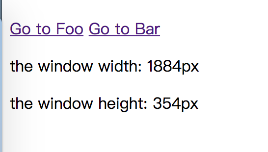

# 如何发现内存泄露

内存泄露是开发过程中难以发现的一种bug。它经常会变得扑朔迷离，让开发者抓狂。它并不像代码异常那样直接在控制台抛出来，而是静静的隐藏在你的代码中，当你写的代码被更多的人使用的时候给予你致命的一击。

那么问题来了，我在开发一个应用的时候，该如何确定应用中存在内存泄露？

有的人认为，应用占用内存很多就一定是内存泄露，这其实是一个错误的想法。软件越复杂，占用的内存也会越大，这是再也正常不过的事情了。任何系统的代码，变量，函数都需要占用内存。开发者有时为了加快软件运行速度，还会在应用中大量利用缓存技术。缓存的使用，就会占用一定量的内存，但是缓存和内存泄露的分界线是：缓存不会无限制的占用内存，而内存泄露会。

虽然大家也都在说该如何写代码才能避免内存泄露，但是等你真正写出内存泄露的时候，你根本毫无察觉。我线下测试好好的，不是吗？

本节将介绍如何使用Chrome的devtools来发现内存泄露问题，能够让你在完成产品功能之后，立刻找出代码中潜在的内存泄露。

## 难以发现的泄露

> 本demo的代码都可以在github上进行获取：[获取地址](https://github.com/andycall/master-of-javascript-memory/blob/master/demo/vue%20leak/index.html)

假如现在有个基于Vue开发的SPA页面，页面有2个路由地址，可以自由进行切换。一个页面只显示一段文字，而另外一个页面会实时获取到浏览器框的宽和高。



在这个页面上，有一个潜在的内存泄露问题——如果连续在Foo和Bar之间切换，内存会以肉眼不可见的形式增长。这乍一看貌似问题不大，不过如果我尝试增大Foo页面所占用内存的大小的话，内存泄露的问题就会被放大。

救火最佳的时机就是在刚起火的时候来一盆水，那么问题来了，对于这种难以发现的场景，该如何去发现和定位问题呢？

### 基于时间线的内存调试工具

Chrome devtools提供了一种可以基于时间线的内存调试工具——`Allocation instrumentation on timeline`。通过这样的工具，就能很清晰的观察当前内存的状态。


打开devtools，选取Memory，然后再选中第二个选项，就可以进行基于时间线的录制了。点击Start按钮，进入录制模式。

这时候，使用鼠标在页面上反复切换`Go to Foo`和`Go to Bar`，就可以观察到调试工具不断画出了一些蓝色的线条。


如果重复以上步奏，使用[已经修复内存泄露的例子](<https://github.com/andycall/master-of-javascript-memory/blob/master/demo/vue%20leak/index_fixed.html>)进行录制的话，可以得到下图的线条。


通过肉眼就能很明显的对比出来，在2s之后，第二张图几乎看不到任何蓝色的线条，大部分内容都是由灰色线条组成。而第一张图，每过一段时间就有一小截蓝色线条出现，蓝色和灰色线条各占一半。

在这样的图中，**蓝色的线条都代表当前进行了一些内存的分配，而灰色的线条代表GC已经成功将分配出去的内存回收了**。所以从第一张图中，我们就可以直接看出，每一次切换页面之后，都有将近一半的内存收不回来。而这些收不回来的内存就是潜在的泄露。

### 分析某一时段的内存

现在可以确认第一个例子中，在切换页面的过程中，内存发生了泄露，接下来，可以直接在图表上，选取某一个没有被回收的蓝色线条，来作为分析的依据。


选择之后，devtools会显示出在当前时间段内，被分配出去的对象列表。这时，我们可以注意到，这里有一个`VueComponent`对象，这说明在进行切换的时候，上一个页面的Vue实例并没有被释放。


点击 `VueComponent @2275067`， 就可以查看在内存中，其他对象和这个Vue对象之间的引用关系。


选中之后，上图的`Retainers`下面就列举出了所有引用这个`Vue Component`的对象。乍一看感觉挺复杂，这时候如果将这些对象都展开，就会在每一个对象的引用关系链中，找到一个来自于`index.html`的一个`context`。`context`在内存中一般是标识这是一个闭包，由一个函数来生成。


这样就能说明，虽然有这么多对象引用这个`Vue Component`，但是它们都被这个来自于`index.html`的一个函数创建的闭包所引用，这时候再顺着右边的链接跳转到代码，就能发现问题所在。


## 看似没问题的事件监听

确定了问题，再回来看页面的代码。Foo组件的代码很简短，除了渲染数据到页面之外，只有一个监听`Window`对象的事件监听函数，并实时将数据同步到页面上。

```javascript
const Foo = {
    template: `
<div>
<p>the window width: {{width}}px</p>
<p>the window height: {{height}}px</p>
</div>`,
    data: function() {
        return {
            width: window.innerWidth,
            height: window.innerHeight
        }
    },
    mounted() {
        window.addEventListener('resize', () => {
            this.width = window.innerWidth;
            this.height = window.innerHeight;
        });
    }
};
```

这乍一看确实没有什么问题，而且页面确实能够正常运行。不过问题恰好就出在这个事件监听上了，在JavaScript中，事件监听都会一直持有对监听函数的引用，而这个函数恰好是一个箭头函数，它的`this`指向正是Vue的实例，并且在箭头函数内部，就有两行调用`this`的代码。因此就会形成一个链式的引用关系，一直延续到全局的Window对象，导致整个链条上所有的对象都不会被GC所释放。从内存中也可以印证这一点：


## 不要忘记解除事件绑定

由于事件的绑定，让Vue实例和Window对象之间形成了一条引用关系，从而导致Vue实例无法被释放，因此解决这个问题的关键就是要解除这条引用关系。所以只需要在Vue实例即将要销毁的时候，清空已经绑定的事件，就可以解除Vue 实例和Window之间的关系，从而能够让Vue 实例可以正常被释放。

```javascript
const Foo = {
    template: `
<div>
<p>the window width: {{width}}px</p>
<p>the window height: {{height}}px</p>
</div>`,
    data: function() {
        return {
            width: window.innerWidth,
            height: window.innerHeight
        }
    },
    mounted() {
        this.resizeFunc = () => {
            this.width = window.innerWidth;
            this.height = window.innerHeight;
        };
        window.addEventListener('resize', this.resizeFunc);
    },
    beforeDestroy() {
        window.removeEventListener('resize', this.resizeFunc);
        this.resizeFunc = null;
    }
};
```

